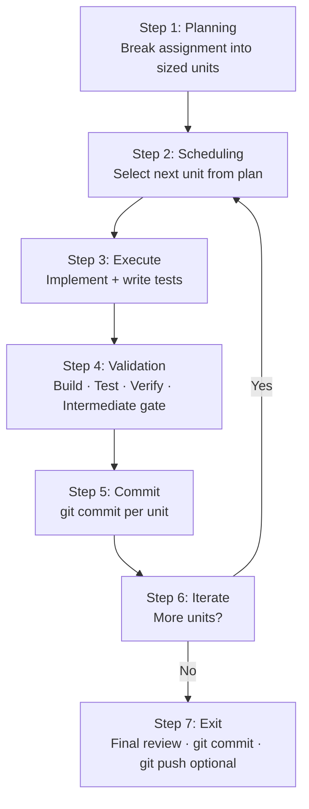

# Assignment Iterative Process

> Describes: once implementation starts, how to execute safely and incrementally.
> Status: evolving — mark additions and changes with `[date]`.

---

## Underlying Pattern: ReAct (Reason + Act + Observe)

This iterative loop implements the **ReAct pattern** — the standard execution model for most agent implementations:

```
Reason about what to do next
  → Act (implement the unit)
    → Observe the outcome (validate, check for regressions)
      → Reason about the next unit
```

Each iteration is one complete ReAct cycle. The loop continues until all units are done or a blocking issue is encountered. If the observation reveals a problem (failing tests, scope mismatch, architectural issue), the agent reasons about it before acting on the next unit — not during.

---

## Overview



---

## Steps

### Step 1: Planning

Before the first iteration, break the approved implementation plan into sized, independently committable units of work. Each unit must be:

- Small enough to implement and test in a single iteration
- Independently committable without breaking the build
- Clearly scoped — no ambiguity about when it is done

### Step 2: Scheduling

Select the next unit from the implementation plan. Update its status to `In progress`.

### Step 3: Execute

Implement the unit:
- Write the code
- Write the tests (unit and integration as applicable)
- Do not move to Step 4 until both are done

### Step 4: Validation (Intermediate Gate)

Before committing:
- [ ] Code builds without errors or warnings
- [ ] New tests pass
- [ ] No regressions in existing tests
- [ ] Formatting and style standards met
- [ ] Dependencies correctly versioned
- [ ] Type safety reviewed
- [ ] Relevant design pattern checks complete
- [ ] RLC lens applied: full lifecycle considered for each resource introduced in this unit (see `governance/rlc.md`)

If the gate fails, fix the issue before proceeding. Do not commit broken work.

### Step 5: Commit

```bash
git commit -m "[unit description] — [brief rationale if non-obvious]"
```

- One commit per unit of work
- Descriptive message — the commit history should be readable
- Update implementation plan status to `Complete`

### Step 6: Iterate

Are there more units in the implementation plan?

- **Yes** → return to Step 2
- **No** → proceed to Step 7

### Step 7: Exit

Final actions before closing the implementation phase:

1. Final quality gate review (see `assignment-workflow.md` Step 5)
2. Final git commit (cleanup, TODOs, final touches)
3. `git push` — optional, governed by team policy
4. Hand off to retrospective phase

---

## Key Principles

- Each iteration processes **one small unit of work** and **commits it** before moving to the next.
- Small, tested, incremental commits create a clean, legible git history.
- Each unit must be independently committable without breaking the build.
- Do not batch commits. Do not carry uncommitted changes across unit boundaries.
- If a unit turns out to be too large, split it and update the implementation plan.

---

## Step and Phase Distinction

| Concept | Definition |
|---|---|
| **Step** | An atomic, independently committable unit of work. Corresponds to one iteration of the loop above. Produces one git commit. |
| **Phase** | A milestone-level group of Steps. A Phase is complete only when all its Steps are complete and the Phase Closure Checklist passes. |

Assignment scope determines how Steps are grouped into Phases. A small assignment may be a single Phase. Larger assignments with natural milestones (e.g. data layer, API layer, integration) benefit from multiple Phases.

---

## Step Closure Checklist

Run after every Step (before `git commit`):

- [ ] Unit tests pass
- [ ] Integration tests pass (if applicable for this step)
- [ ] Code auto-formatted (run formatter on changed files)
- [ ] Technologist/developer review requested and completed
- [ ] Decisions recorded in project decision log (if any were made)
- [ ] Lessons learned updated (if anything notable arose)
- [ ] `git commit` with descriptive message
- [ ] Implementation plan status updated to `Complete` for this step

---

## Phase Closure Checklist

Run when all Steps in a Phase are complete (before opening the next Phase):

- [ ] Formatter run across all changed files in this phase
- [ ] Linters pass (language-specific)
- [ ] Security scan complete (SAST or equivalent)
- [ ] Dependency security check (BOM check, license scan, known vulnerabilities)
- [ ] Full test suite passes (all unit + integration tests)
- [ ] Technologist/developer review of the phase as a whole
- [ ] Decisions log updated for decisions made in this phase
- [ ] Lessons-learned file updated (all three sources: agent, technologist, tech stack)
- [ ] Changelog updated with human-readable summary of changes
- [ ] Context prepared for next phase (update session-context.md if resuming later)

---

## Failure Handling

- If a Step fails validation, stop and diagnose. Do not proceed to the next Step.
- Do not skip or disable tests to force passage.
- Do not mark a Step complete when tests are failing.
- Document blockers explicitly: what failed, what was tried, what remains unresolved.
- A blocked Phase requires technologist input before work resumes.
