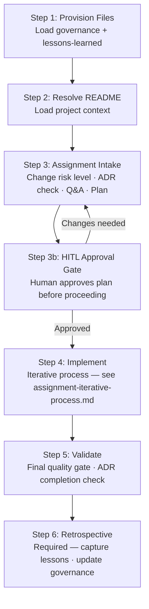

# Assignment Workflow

> Describes: the full assignment workflow end-to-end.
> Status: evolving — mark additions and changes with `[date]`.

---

## Overview

---

## Steps

### Step 1: Provision Files

Load the governance layer for this session:

- Base system prompt (`docs/governance/system-prompts/base-system-prompt.md`)
- Relevant language overlay (`docs/library/<lang>/instructions.md`)
- Active lessons-learned file
- Session context file (if resuming)

### Step 2: Resolve README

Load project context:

- Project README or agent-scoped README
- Any existing `session-context.md`
- Status of any prior assignment

### Step 3: Assignment Intake

Execute in order:

1. **Change risk level** — Low / Medium / High / Breaking
2. **ADR check** — does this change require an Architecture Decision Record?
3. **Q&A** — the agent asks questions; the technologist answers until no open questions remain
4. **Refinement** — scope is confirmed, deferrals are logged
5. **Plan** — agent creates the implementation plan with unit breakdown and status tracking
6. **Testing requirements** — unit and integration tests specified

> Keep intake quality high. A strong plan in Step 3 determines implementation quality downstream.

### Step 3b: HITL Approval Gate

> *HITL = Human-in-the-Loop: a mandatory checkpoint where a human reviews and approves before the process continues.*

The technologist reviews and approves the implementation plan. No implementation begins without approval.

This gate is **hard** — do not skip it, especially for medium/high/breaking change risk assignments.

### Step 4: Implement

Execute the iterative implementation loop. See `assignment-iterative-process.md`.

> Match model capability to step complexity to balance quality and cost:
> - Planning and reasoning steps: more capable model
> - Mechanical implementation: standard model
> - Minor tasks: lighter model

### Step 5: Validate

Final quality gate:

- Verify implementation plan is fully complete
- Verify all tests exist, pass, and meet coverage targets
- Validate assignment goals are met against original scope
- ADR completion check (if applicable)
- All TODOs listed and triaged
- Branches cleaned up

### Step 6: Retrospective *(required)*

- Capture lessons learned: LLM Agent, Technologist, Tech Stack
- Identify any lessons that recur and are candidates for governance promotion
- Update governance files if warranted
- Close the assignment

---

## Key Principles

- Execute steps **in order**. Do not skip hard gates — especially the HITL Approval Gate (Step 3b).
- Match model capability to step complexity to balance quality and cost.
- Keep intake quality high: a strong plan in Step 3 determines implementation quality downstream.
- Use written session artifacts (`agent-assignment.md`, `session-context.md`) as source of truth for cross-model and cross-session handoffs.
- Treat ADRs as delivery requirements for higher change-risk assignments, not optional documentation.
- Close the loop with the retrospective. Lessons that are not captured are lessons that will be repeated.

---

## Model Tier Check

Before beginning intake, verify the current model tier and confirm it is appropriate for the assignment's change risk level:

- **Planning and Reasoning** (intake, ADRs, architecture decisions): higher-capability model
- **Implementation** (coding, testing): standard model
- **Minor tasks** (formatting, renaming, small fixes): lighter model

Prompt the technologist to confirm model mapping if the assignment is medium or higher impact.
