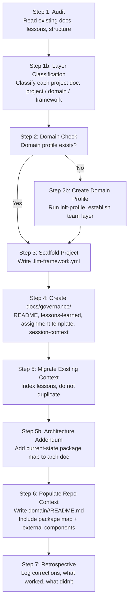

# Workflow: Retrofit Existing Project

> Use this workflow to bring an existing project into compliance with the LLM Agent Collaboration Framework.
> This is distinct from starting a new project — it assumes existing docs, conventions, and lessons are already present.

---

## Core Principle

> **The framework governs how work runs. The project holds only what is unique to this project.**

The `llm-agent-framework` and its domain overlays (`llm-agent-domains/<team>/`) are the authoritative source for how agents work — engineering principles, language patterns, testing standards, collaboration protocols. The project repo holds only what cannot live anywhere else: the project's specific architecture, its package map, its unique rules, and its own lessons.

**During a retrofit, this principle is the primary filter.** Every project-level doc must be asked: does this content apply only to this project, or does it describe something general (a design pattern, a language practice, a process rule) that belongs in the domain or framework? If the content belongs in a higher layer and that layer does not yet have it, promote it. If the layer already has it, replace the project doc with a pointer or archive it.

Pre-framework projects commonly accumulate generic content in their `docs/` trees — Go principles, architecture blueprints, code quality guides — because those layers did not exist yet. The retrofit is the time to correct this. Leaving generic content in the project creates competing governance systems that agents cannot resolve.

---

## Overview



---

## Steps

### Step 1: Audit

Before writing anything, read the project:

- Project README
- Existing lessons, guidelines, and working notes (wherever they live)
- Existing workflow or process documentation
- `docs/` structure (or equivalent)

**Broken-reference scan:** For every pre-existing governance or guidelines file, extract all internal path references and verify each one exists on disk. List broken refs in the audit output before doing anything else. Do not assume referenced files are at their stated paths — they move as projects evolve.

**Conflict map for pre-existing agent governance files:** If the project has working agent guidelines (`AGENT-WORKING-GUIDELINES.md`, `README-agent.md`, `copilot-instructions.md`, or similar), produce an explicit section-by-section map before writing any new governance files:
- Which sections are superseded by which framework layer (infrastructure, domain Go, domain Fyne, etc.)?
- Which sections are unique value not covered by any layer?
- Which sections directly conflict with a framework rule?

Output this conflict map as part of the Step 1 audit — not later. Without it, the retrofit risks producing two competing governance systems rather than one.

**Output:** A summary of what exists and what is missing relative to the framework, plus the broken-reference list and (if applicable) the conflict map. Identify the gaps — do not start filling them yet.

### Step 1b: Layer Classification

For every doc in the project's `docs/` tree (and any standalone governance files), classify it into one of three buckets:

| Bucket | Meaning | Action |
|---|---|---|
| **Project-specific** | Content that is unique to this project — its package map, specific architecture decisions, its own bug history, project rules | Keep in project |
| **Domain-level** | Content that applies to all projects in this team/language stack — Go patterns, Fyne patterns, testing conventions | Promote to `llm-agent-domains/<team>/library/<lang>/governance-overlay.md` if not there; if already covered, replace project doc with a pointer or archive it |
| **Framework-level** | Universal, language-agnostic principles — collaboration protocols, engineering principles, workflow patterns | Propose for `llm-agent-framework/` if not there; never write directly to framework |

**Signal that a doc is NOT project-specific:**
- Its title is a general concept ("SOLID Principles", "Avoiding God Objects", "Code Quality Guide")
- Its examples use generic variable names rather than actual project types
- It describes how to do something, not what THIS project specifically does
- It could be copy-pasted into another project and apply without changes

Pre-framework projects commonly have `docs/architecture/` and `docs/guides/` files that are textbook Go or design principles with no project-specific content. These must be reclassified — leaving them in the project creates a competing governance system that agents cannot resolve against the domain overlays.

**Output:** A classification table. For each doc: bucket, disposition (keep / promote / pointer / archive), and the target layer if promoting.

### Step 2: Domain Check

Does a domain profile repo exist for this project's team?

- If **yes**: confirm the path and continue
- If **no**: **stop here**. Run `init-profile` (tool) or follow the team template manually to create it. Do not write project-level governance files before the domain layer exists — project files will reference the wrong paths or duplicate content that belongs in the domain layer

### Step 3: Scaffold Project

Run `scaffold-project` (tool) or manually write `.llm-framework.yml` at the project root:

```yaml
infrastructure: <path-to-llm-agent-framework>
team: <path-to-domain-profile>
```

Confirm all declared paths exist before writing.

### Step 4: Create `docs/governance/`

Create the following files in the project repo. These are the only files that belong here — not agent behavior rules (those go in the domain profile).

| File | Content |
|---|---|
| `docs/governance/README.md` | Session-start load order; index of what to read and where |
| `docs/governance/lessons-learned.md` | Framework-format lessons summary; links to existing detailed files |
| `docs/governance/agent-assignment.md` | Assignment template (copy from `llm-agent-framework/templates/agent-assignment.md`) |
| `docs/governance/session-context.md` | Cross-session handoff template (copy from `llm-agent-framework/templates/session-context.md`) |

> **Do not** put agent behavior rules, doc-placement rules, or repo constraints in `docs/governance/`. Those belong in the domain profile's `<repo-name>/README.md`.

**When pre-existing governance files partially overlap with framework layers:** Do not delete them — they may contain unique history or supplementary detail not in the overlays. Instead:
1. Add a visible "⚠ Partially Superseded" block at the top of each conflicting section, naming the authoritative overlay path and stating that the overlay takes precedence on conflicts.
2. Update the `docs/governance/README.md` "Existing Project Documentation" table to note which sections are superseded.
3. Do NOT reproduce the superseded content in the domain profile — reference the pre-existing file from the domain profile's load order as "supplementary context" only.

**Project enforcement rules (doc placement, credentials policy, script standards):** These do not have a home in the standard four `docs/governance/` files. Decide before Step 4: either inline in `docs/governance/README.md` or create `docs/governance/project-rules.md`. Without this decision, enforcement rules become homeless during the retrofit and risk being lost.

### Step 5: Migrate Existing Context

Index — do not duplicate — existing lessons and guidelines into `docs/governance/lessons-learned.md`:

- Add a row or pointer for each existing lessons file
- Extract any lessons that recur or are framework-relevant into the framework-format sections (LLM Agent / Technologist / Tech Stack)
- Identify candidates for promotion to the domain Go overlay or domain governance overlay

Do not delete or move existing lessons files. They are the authoritative detail; `lessons-learned.md` is the summary and promotion log.

### Step 5b: Architecture Addendum

If the project has an existing architecture document, **do not rewrite it**. Instead, add a `## Current-State Package Map` addendum section to it:

- Map every package to its layer in the project's architecture model
- Note packages with known risks (god-object, boundary violations)
- Add an **External Reusable Components** table — any libraries or sibling repos that provide components the agent should use instead of re-implementing
- Add a **Composition Rule** for any base type that all implementations must compose from (e.g., a base dialog, a base widget)

This addendum is what agents actually read — it gives spatial orientation in seconds without requiring a read of the full document.

**If no architecture doc exists:** create one in `docs/architecture/` as part of the onboarding. The package map is the minimum viable content.

### Step 6: Populate Repo Context in Domain Profile

Write `<domain-profile>/<repo-name>/README.md`:

- Project identity (name, language, framework, file format)
- Session-start load order (numbered, with full paths) — include the architecture doc as a step, with a note to read only the Current-State Package Map section unless doing architecture work
- **Package Map quick-reference table** — a condensed version of the architecture addendum ("I need to do X → go to package Y → layer Z")
- **External Reusable Components** — the same table from the architecture addendum, repeated here so agents see it without loading the full arch doc
- Repo-specific doc-placement rules (if the project has a strict doc structure)
- Git workflow constraints specific to this repo

This file is what the agent reads at session start to orient to *this specific repo* within the domain. It is not assignment-specific.

**Verification checklist before closing Step 6:** Every path referenced in the domain repo context file must be confirmed to exist on disk. Check:
- [ ] All load-order file paths exist
- [ ] All lesson file paths exist
- [ ] All doc-placement rule locations (directories) exist
- [ ] All external component repo paths exist

A broken path in the domain repo context file causes silent session-start failures — agents load nothing and don't know why.

### Step 7: Retrospective

Before closing:

1. Log what was created correctly, what was corrected, and what was deferred in `docs/governance/lessons-learned.md` under a retrofit session heading
2. Note any agent mistakes (wrong file placement, wrong promotion target, missing domain check) so they can improve this workflow
3. Note any patterns that should be promoted to the domain overlay or proposed to the infrastructure framework

---

*Accumulated lessons from all retrofit applications: [`governance/lessons-learned/retrofit-project-2026.md`](../lessons-learned/retrofit-project-2026.md)*
