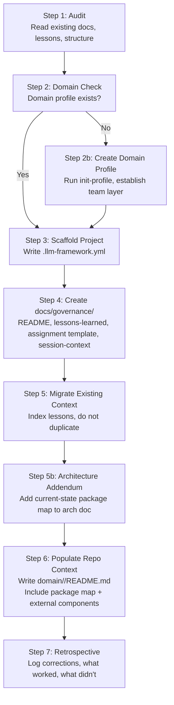

# Workflow: Retrofit Existing Project

> Use this workflow to bring an existing project into compliance with the LLM Agent Collaboration Framework.
> This is distinct from starting a new project — it assumes existing docs, conventions, and lessons are already present.

---

## Overview



---

## Steps

### Step 1: Audit

Before writing anything, read the project:

- Project README
- Existing lessons, guidelines, and working notes (wherever they live)
- Existing workflow or process documentation
- `docs/` structure (or equivalent)

**Output:** A summary of what exists and what is missing relative to the framework. Identify the gaps — do not start filling them yet.

### Step 2: Domain Check

Does a domain profile repo exist for this project's team?

- If **yes**: confirm the path and continue
- If **no**: **stop here**. Run `init-profile` (tool) or follow the team template manually to create it. Do not write project-level governance files before the domain layer exists — project files will reference the wrong paths or duplicate content that belongs in the domain layer

### Step 3: Scaffold Project

Run `scaffold-project` (tool) or manually write `.llm-framework.yml` at the project root:

```yaml
infrastructure: <path-to-llm-agent-framework>
team: <path-to-domain-profile>
```

Confirm all declared paths exist before writing.

### Step 4: Create `docs/governance/`

Create the following files in the project repo. These are the only files that belong here — not agent behavior rules (those go in the domain profile).

| File | Content |
|---|---|
| `docs/governance/README.md` | Session-start load order; index of what to read and where |
| `docs/governance/lessons-learned.md` | Framework-format lessons summary; links to existing detailed files |
| `docs/governance/agent-assignment.md` | Assignment template (copy from `llm-agent-framework/templates/agent-assignment.md`) |
| `docs/governance/session-context.md` | Cross-session handoff template (copy from `llm-agent-framework/templates/session-context.md`) |

> **Do not** put agent behavior rules, doc-placement rules, or repo constraints in `docs/governance/`. Those belong in the domain profile's `<repo-name>/README.md`.

### Step 5: Migrate Existing Context

Index — do not duplicate — existing lessons and guidelines into `docs/governance/lessons-learned.md`:

- Add a row or pointer for each existing lessons file
- Extract any lessons that recur or are framework-relevant into the framework-format sections (LLM Agent / Technologist / Tech Stack)
- Identify candidates for promotion to the domain Go overlay or domain governance overlay

Do not delete or move existing lessons files. They are the authoritative detail; `lessons-learned.md` is the summary and promotion log.

### Step 5b: Architecture Addendum

If the project has an existing architecture document, **do not rewrite it**. Instead, add a `## Current-State Package Map` addendum section to it:

- Map every package to its layer in the project's architecture model
- Note packages with known risks (god-object, boundary violations)
- Add an **External Reusable Components** table — any libraries or sibling repos that provide components the agent should use instead of re-implementing
- Add a **Composition Rule** for any base type that all implementations must compose from (e.g., a base dialog, a base widget)

This addendum is what agents actually read — it gives spatial orientation in seconds without requiring a read of the full document.

**If no architecture doc exists:** create one in `docs/architecture/` as part of the onboarding. The package map is the minimum viable content.

### Step 6: Populate Repo Context in Domain Profile

Write `<domain-profile>/<repo-name>/README.md`:

- Project identity (name, language, framework, file format)
- Session-start load order (numbered, with full paths) — include the architecture doc as a step, with a note to read only the Current-State Package Map section unless doing architecture work
- **Package Map quick-reference table** — a condensed version of the architecture addendum ("I need to do X → go to package Y → layer Z")
- **External Reusable Components** — the same table from the architecture addendum, repeated here so agents see it without loading the full arch doc
- Repo-specific doc-placement rules (if the project has a strict doc structure)
- Git workflow constraints specific to this repo

This file is what the agent reads at session start to orient to *this specific repo* within the domain. It is not assignment-specific.

### Step 7: Retrospective

Before closing:

1. Log what was created correctly, what was corrected, and what was deferred in `docs/governance/lessons-learned.md` under a retrofit session heading
2. Note any agent mistakes (wrong file placement, wrong promotion target, missing domain check) so they can improve this workflow
3. Note any patterns that should be promoted to the domain overlay or proposed to the infrastructure framework

---

## Lessons Learned (from RTK retrofit, 2026-06-10)

These lessons were validated in the first real application of this workflow and are incorporated into the steps above.

| # | Lesson | Step Affected |
|---|---|---|
| L-1 | Always check for the domain profile before creating any project-level file. Agent proceeded to create `docs/governance/system-prompt-additions.md` with content that belonged in the domain layer because the domain profile didn't exist yet. | Step 2 (hard block) |
| L-2 | `docs/governance/` holds only: load-order README, lessons-learned, assignment template, session-context. Nothing else. Agent behavior rules, doc-placement rules, and repo constraints belong in the domain profile's `<repo-name>/README.md`. | Step 4 |
| L-3 | For existing architecture docs, add an addendum — do not rewrite. The addendum (Current-State Package Map) is the agent-facing artifact; the full doc is human reference. | Step 5b (new) |
| L-4 | The package map must be duplicated (in condensed form) in the domain repo context file. Agents load the domain context file at session start; they should not need to open the architecture doc to know where code goes. | Step 6 |
| L-5 | External reusable components (sibling repos, shared libraries) must be explicitly listed in both the architecture addendum and the domain repo context. Agents will re-implement rather than discover existing components without this. | Step 5b, Step 6 |
| L-6 | Composition rules ("all dialogs must use DialogManager", "all tables must use table.Table") must be written as explicit correct/wrong examples, not just stated as rules. Examples prevent misapplication. | Step 5b |

---

## Lessons Learned (from local-lab-ai-stack retrofit, 2026-06-22)

| # | Lesson | Step Affected |
|---|---|---|
| L-1 | **Step 1 audit must explicitly cover existing agent governance files.** Projects with a working governance system (README-agent.md, copilot-instructions.md, custom session protocols) need those files audited for framework conflicts before any new governance files are written. Identify: what exists, what clashes rule-by-rule, and what is unique value to preserve. Without this, the retrofit produces two competing governance systems rather than one unified one. | Step 1 |
| L-2 | **Git-tracked meta files resist .gitignore migration.** If session-state files (review logs, dynamics) were previously committed to git, adding them to .gitignore does NOT stop git from tracking changes. During meta migration, run `git rm --cached <file>` for each historically-tracked meta file. Verify with `git ls-files <path>` before assuming a file is untracked. | Step 5 |
| L-3 | **Platform-specific memory file references may not exist as physical files.** Governance docs that reference platform runtime state (e.g., VS Code Copilot's `/memories/*.md` paths) may point to files that were never created on disk. Verify referenced files exist before planning moves or rewrites. These are broken references that must be replaced with framework-canonical paths, not files to be migrated. | Step 1 |
| L-4 | **The README-agent.md within-repo scoping convention is compatible with the framework's cross-repo layer resolution.** They operate at different scopes: README-agent.md governs directory-level authority within a project repo; the framework governs cross-repo loading order. No conflict exists — but this must be stated explicitly in the domain repo context file, otherwise agents treat them as competing systems. | Step 6 |
| L-5 | **Project enforcement rules have no standard home in the framework.** `docs/governance/` holds four files: load-order README, lessons-learned, assignment template, session-context. Project-specific hard rules (credentials policy, script structure standards, config SSOT rules, deviation policy) are not covered. Without an explicit placement decision, these rules become homeless during retrofit and risk being lost. Resolve before Step 4: inline in `docs/governance/README.md`, or a new `docs/governance/project-rules.md`. | Step 4 |
| L-6 | **Use `./tmp` as a tracked staging area for content under review.** Moving files to `./tmp` (and removing `tmp/` from `.gitignore`) lets you commit content for cross-workstation access while it awaits migration decisions. This is preferable to deleting content that has not yet been re-homed. Restore the gitignore entry when the retrofit is complete. | Step 5 |
| L-7 | **Domain meta directory is a new pattern not in the template.** The framework template defines only `<domain>/<repo-name>/README.md`. A `meta/<repo-name>/` directory at the domain repo root — to hold session state files (review_log, dynamics, agent-context) that are project-specific but not tracked in the project repo — was invented during this retrofit. If this pattern holds across multiple projects, it should be added to the domain template. | Step 6 |
