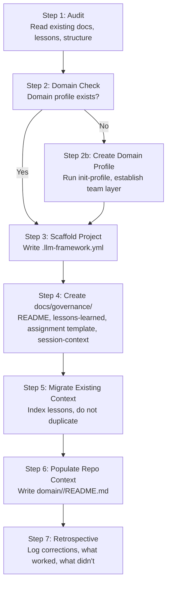

# Workflow: Retrofit Existing Project

> Use this workflow to bring an existing project into compliance with the LLM Agent Collaboration Framework.
> This is distinct from starting a new project — it assumes existing docs, conventions, and lessons are already present.

---

## Overview



---

## Steps

### Step 1: Audit

Before writing anything, read the project:

- Project README
- Existing lessons, guidelines, and working notes (wherever they live)
- Existing workflow or process documentation
- `docs/` structure (or equivalent)

**Output:** A summary of what exists and what is missing relative to the framework. Identify the gaps — do not start filling them yet.

### Step 2: Domain Check

Does a domain profile repo exist for this project's team?

- If **yes**: confirm the path and continue
- If **no**: **stop here**. Run `init-profile` (tool) or follow the team template manually to create it. Do not write project-level governance files before the domain layer exists — project files will reference the wrong paths or duplicate content that belongs in the domain layer

### Step 3: Scaffold Project

Run `scaffold-project` (tool) or manually write `.llm-framework.yml` at the project root:

```yaml
infrastructure: <path-to-llm-agent-framework>
team: <path-to-domain-profile>
```

Confirm all declared paths exist before writing.

### Step 4: Create `docs/governance/`

Create the following files in the project repo. These are the only files that belong here — not agent behavior rules (those go in the domain profile).

| File | Content |
|---|---|
| `docs/governance/README.md` | Session-start load order; index of what to read and where |
| `docs/governance/lessons-learned.md` | Framework-format lessons summary; links to existing detailed files |
| `docs/governance/agent-assignment.md` | Assignment template (copy from `llm-agent-framework/templates/agent-assignment.md`) |
| `docs/governance/session-context.md` | Cross-session handoff template (copy from `llm-agent-framework/templates/session-context.md`) |

> **Do not** put agent behavior rules, doc-placement rules, or repo constraints in `docs/governance/`. Those belong in the domain profile's `<repo-name>/README.md`.

### Step 5: Migrate Existing Context

Index — do not duplicate — existing lessons and guidelines into `docs/governance/lessons-learned.md`:

- Add a row or pointer for each existing lessons file
- Extract any lessons that recur or are framework-relevant into the framework-format sections (LLM Agent / Technologist / Tech Stack)
- Identify candidates for promotion to the domain Go overlay or domain governance overlay

Do not delete or move existing lessons files. They are the authoritative detail; `lessons-learned.md` is the summary and promotion log.

### Step 6: Populate Repo Context in Domain Profile

Write `<domain-profile>/<repo-name>/README.md`:

- Project identity (name, language, framework, file format)
- Session-start load order (numbered, with full paths)
- Repo-specific doc-placement rules (if the project has a strict doc structure)
- Git workflow constraints specific to this repo

This file is what the agent reads at session start to orient to *this specific repo* within the domain. It is not assignment-specific.

### Step 7: Retrospective

Before closing:

1. Log what was created correctly, what was corrected, and what was deferred in `docs/governance/lessons-learned.md` under a retrofit session heading
2. Note any agent mistakes (wrong file placement, wrong promotion target, missing domain check) so they can improve this workflow
3. Note any patterns that should be promoted to the domain overlay or proposed to the infrastructure framework
